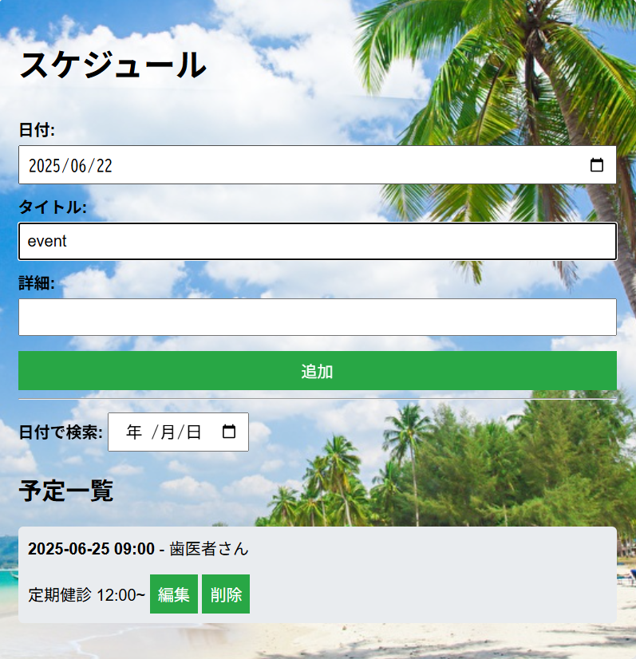
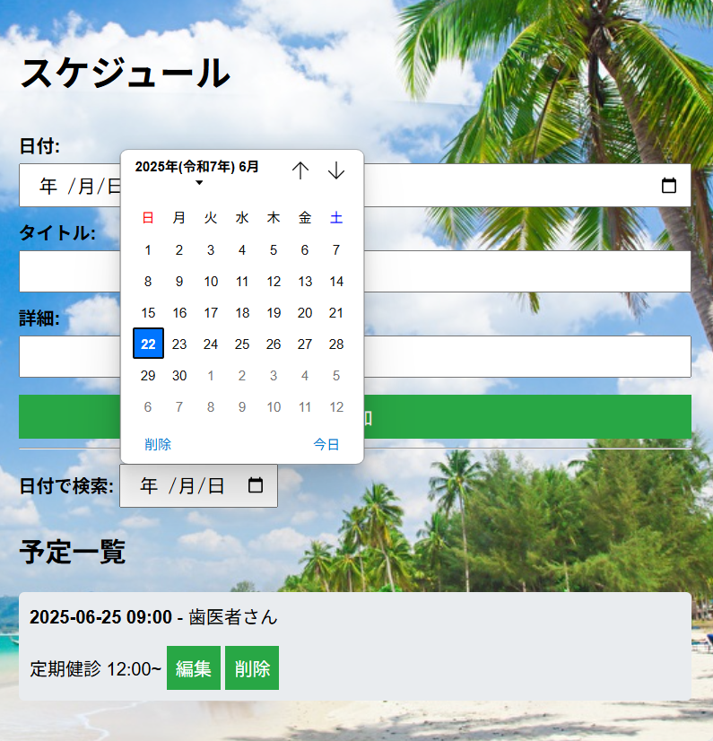

# Webスケジュールアプリ
JavaScriptとSpring Bootで作成したシンプルなスケジュール管理Webアプリです。

予定の追加、編集、削除、日付検索機能を備えたTodo形式のUIを備えています。





## 概要
- スケジュールの追加・編集・削除
- 日付ごとの予定検索機能
- レスポンシブ対応のシンプルUI
- 背景画像のカスタマイズ(GUIサイズにフィット)

## 使用技術(言語)

### フロントエンド
- HTML / CSS
- JavaScript(Vanilla)

### バックエンド
- Java
- Spring Boot
- Thymeleaf(HTMLテンプレートエンジン)
- RESTful API('/api/schedules')

### その他
- Git(バージョン管理)

## 🛠️ 動作環境
- JDK 24(Java 11+)
- Spring Boot
- Maven

## 🚀 実行方法
1. **リポジトリのクローン**

   ```bash
   git clone https://github.com/motomasMINO/ScheduleApp-Web.git

   cd ScheduleApp-Web
   ```

2. **アプリ起動**

   ```bash
   mvnw spring-boot:run
   ```

3. **ブラウザでアクセス**

   http://localhost:8080

   またはIndex.htmlをブラウザで開くだけでOKです。
   
   Spring Bootが起動していれば動作します。

## 🌐 APIエンドポイント
| メソッド | パス | 説明 |
| ---------- | ---------- | ---------- |
| GET | /api/schedules | 予定を全件取得 |
| GET | /api/schedules/{id} | 指定IDの予定取得 |
| GET | /api/schedules/search?date=YYYY-MM-DD | 日付で予定を検索 |
| POST | /api/schedules | 新規予定を追加 |
| PUT | /api/schedules/{id} | 予定を更新 |
| DELETE | /api/schedules/{id} | 予定を削除 |

## 📜 ライセンス
このプロジェクトはMIT Licenseのもとで公開されています。

## 📧 お問い合わせ
- **GitHub: motomasMINO**
- **Email: yu120615@gmail.com**

  バグ報告や改善点・機能追加の提案はPull RequestまたはIssureで受け付けています!
  