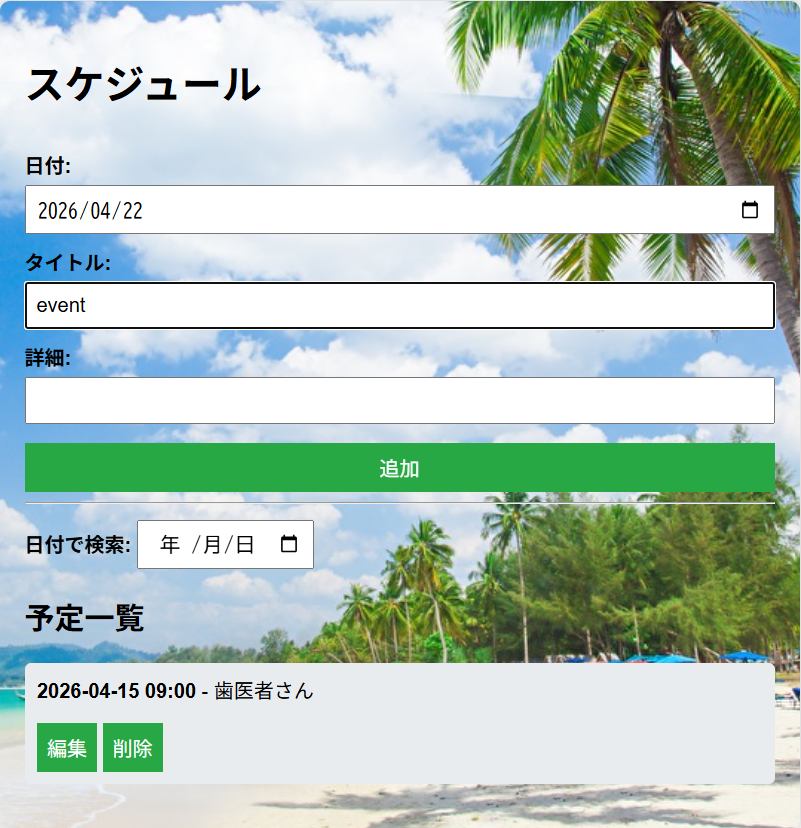
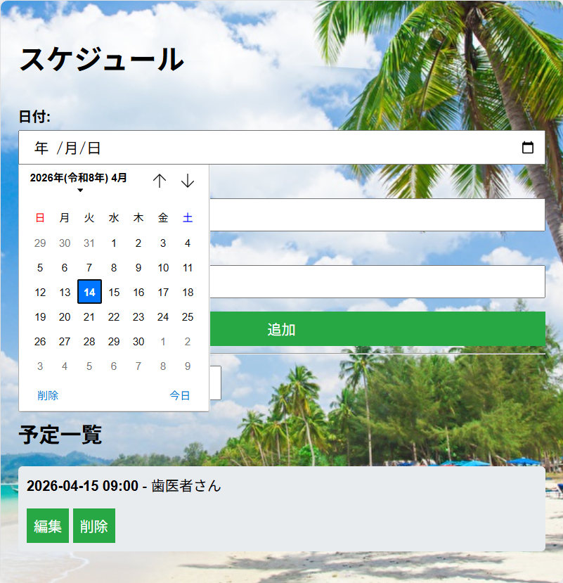

# Webスケジュールアプリ
JavaとSpring Bootで作成したスケジュール管理Webアプリです。

追記1: ユーザー認証機能を実装しました。
　　　ご利用の際はユーザー登録(アカウント作成)・ログインをお願いいたします。

追記2: MySQL・Flywayに対応しました。






## 概要
- スケジュールの追加・編集・削除
- 日付ごとの予定検索機能(Todo形式のUI)
- 背景画像のカスタマイズ(GUIサイズにフィット)
- ユーザー登録・ログイン機能
- - ログインユーザーごとの予定管理（他ユーザーの予定は編集・削除不可）

## 使用技術

### フロントエンド
- HTML / CSS
- JavaScript(Vanilla)

### バックエンド
- Java
- Spring Boot
- Spring Security
- Thymeleaf(HTMLテンプレートエンジン)
- RESTful API('/api/schedules')

### データベース
- MySQL
- Flyway(DBマイグレーション管理)

### その他
- Git(バージョン管理)

## 動作環境
- JDK 25(Java 17+)
- Spring Boot
- Maven
- MySQL 8.0

## MySQL権限について

(注意) このアプリを動かすには、以下の権限が必要です。

- CREATE
- ALTER
- INDEX
- REFERENCES
- INSERT / UPDATE / DELETE / SELECT

例：GRANT ALL PRIVILEGES ON schedule_app.* TO 'user'@'localhost';

## 実行方法
1. **リポジトリのクローン**

   ```bash
   git clone https://github.com/motomasMINO/WebScheduleApp.git

   cd WebScheduleApp
   ```

2. **MySQLでDBを用意**
    - データベース名: schedule_app
    - MySQLユーザー名・パスワードをapplication.propertiesに設定   

3. **アプリ起動**

   ```bash
   mvnw spring-boot:run
   ```

4. **ブラウザでアクセス**

   http://localhost:8080

   ※ Spring Boot起動中にアクセスしてください

## APIエンドポイント
| メソッド | パス | 説明 |
| ---------- | ---------- | ---------- |
| POST | /api/auth/signup | ユーザー登録 |
| GET | /api/auth/me | ログイン中ユーザー取得 |
| POST | /api/auth/me/delete | アカウント削除 |
| GET | /api/schedules | 予定を全件取得 |
| GET | /api/schedules/{id} | 指定IDの予定取得 |
| GET | /api/schedules/search?date=YYYY-MM-DD | 日付で予定を検索 |
| POST | /api/schedules | 新規予定を追加 |
| PUT | /api/schedules/{id} | 予定を更新 |
| DELETE | /api/schedules/{id} | 予定を削除 |

## ライセンス
このプロジェクトはMIT Licenseのもとで公開されています。

## お問い合わせ
- **GitHub: motomasMINO**
- **Email: yu120615@gmail.com**

  バグ報告や改善点・機能追加の提案はPull RequestまたはIssueで受け付けています!
  